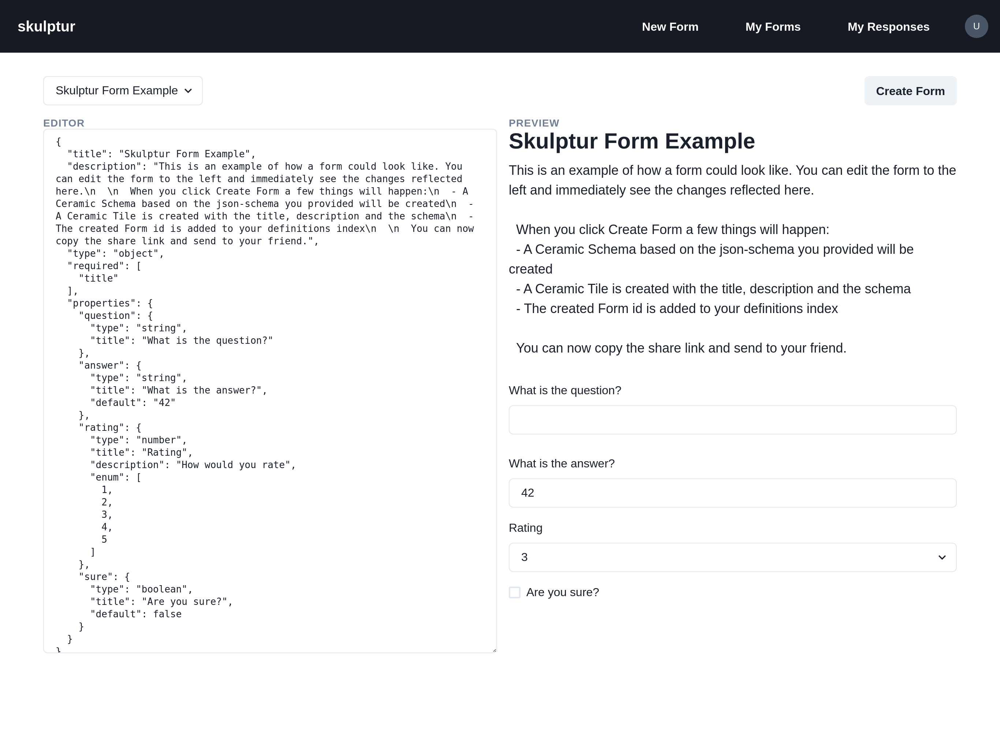

# Skulptur

Decentralized Google Forms built with Ceramic.

- Demo: https://skulptur.vercel.app
- Video: https://www.loom.com/share/fb8389bd8f0841eab813eae8497da265



## Integration with other projects

```js
import model from "@skulptur/model" // note: not actually an npm package yet

// Get all responses for all forms as a mapping: [formId]: responseId
await dataStore.get(model.definitions.formResponses, model.did)
{
    "<formDocId>": {
        "<responseDocId_A>": "<responseDocId_A",
        "<responseDocId_B>": "<responseDocId_B",
    }
}
// Get all created forms for authenticated DID
await dataStore.get(model.definitions.forms)

// Get all responses for authenticated DID
await dataStore.get(model.definitions.responses)

// Load content of Tile
await TileDocument.load(ceramic, "<docId>")
```

#### Created as a submission to Ceramic's Sovereign Data Hackathon

- Link:
  https://gitcoin.co/hackathon/ceramic-identity/projects/11339/skulptur

## Getting Started

First, run the development server:

```bash
npm run dev
# or
yarn dev
```

Open [http://localhost:3000](http://localhost:3000) with your browser to see the result.

## Learn More

To learn more about Next.js, take a look at the following resources:

- [Next.js Documentation](https://nextjs.org/docs) - learn about Next.js features and API.
- [Learn Next.js](https://nextjs.org/learn) - an interactive Next.js tutorial.

You can check out [the Next.js GitHub repository](https://github.com/vercel/next.js/) - your feedback and contributions are welcome!
